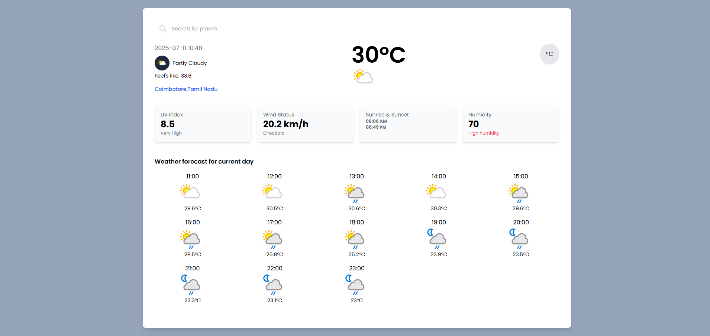

# 🌦️ Simple Weather App

A lightweight, responsive weather application built using **React**, **Vite**, and **Tailwind CSS**. It fetches real-time weather data from [WeatherAPI.com](https://www.weatherapi.com/) and can detect your location to show local weather automatically. If geolocation permission is denied, it defaults to **Coimbatore**.

---

## 🔍 Features

- 📍 Auto-detects user location via browser geolocation
- 🏙️ Allows manual city search
- 🌡️ Shows temperature, humidity, weather condition, and wind speed
- 🎨 Clean and responsive UI using Tailwind CSS
- ⚡ Built with fast and modern Vite + React stack

---

## 📸 Preview

 <!-- Add a screenshot of the app if available -->

---

## 🌐 Live Demo

[https://rakesh-rkz.github.io/simple-weather-app/](https://rakesh-rkz.github.io/simple-weather-app/)

---

## 🛠️ Tech Stack

- [Vite](https://vitejs.dev/)
- [React](https://react.dev/)
- [Tailwind CSS](https://tailwindcss.com/)
- [WeatherAPI](https://www.weatherapi.com/)

---

## 📦 Installation

1. **Clone the repository**:
```bash
git clone https://github.com/rakesh-rkz/simple-weather-app.git
cd simple-weather-app
```
2. **Install dependencies**:
```bash
npm install
```

3. **Create a .env file**:
```bash
WEATHER_API_KEY=your_weatherapi_key_here
```

4. **Run the app locally**:
```bash
npm run dev
```

5. **Build for production**:
```bash
npm run build
```

## 🚀 Deployment

This app is deployed using GitHub Pages via `gh-pages` branch.


## 📄 Vite Config (Important for GitHub Pages)
Make sure your vite.config.ts contains:
```bash
export default defineConfig({
  base: "/simple-weather-app/", # app name
  plugins: [react()],
})
```

## 🔐 API Key
You can get a free API key from WeatherAPI.com. Store it securely in a .env file and never commit it to GitHub.


## 👤 Author
Name: Rakesh

GitHub: @rakesh-rkz

## 📃 License
This project is open source and available under the MIT License.

## 🙌 Contributions
Feel free to fork, enhance, and create pull requests. All contributions are welcome!